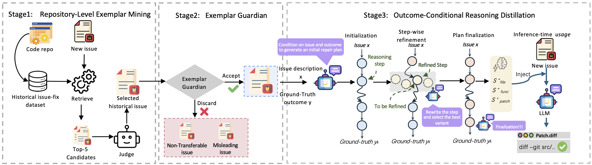

# 🐈‍⬛ From Patches to Plans: Reasoning Distillation for Repository-Level Program Repair

[Abstract]: Repository-level automated program repair (APR) requires long-horizon reasoning over interdependent decisions. However, most LLM-based approaches reconstruct repair reasoning independently for each issue, failing to reuse successful patterns from prior repairs—even though real-world repositories contain many related issues with shared structure or constraints. Existing methods typically rely on forward exploration, which operates under outcome uncertainty, incurs substantial inference-time overhead, and can drift from the final correct patch. We propose Conditional Reasoning Distillation (_ConRAD_), which leverages in-repository resolved issues by reconstructing repair reasoning backward from verified patches and distilling outcome-consistent, stage-wise repair plans. Injected at inference time, these plans guide fault localization and patch generation, replacing open-ended exploration with constrained inference without fine-tuning or search. On SWE-Bench Lite, _ConRAD_ improves Pass@1 by 10.4\% (GPT-4o), 8.6\% (DeepSeek-V3), and 10.3\% (GPT-5), demonstrating a scalable inference-time alternative to forward exploration for long-horizon APR.


[This repository provides an implementation of **_ConRAD_**.]


## ✨ Overview

<p align="center">
  
</p>
<p align="center"><em>Figure 1: ConRAD overview: Stage 1 retrieves in-repository exemplars and selects one via an LLM-based judge. Stage 2 filters candidates
into Transferable, Non-transferable, Misleading. Stage 3 distills outcome-conditioned plans  from the exemplar’s ground-truth fix and injects them as in-context guidance during inference</em></p>

ConRAD consists of three stages that directly correspond to the paper:

1. **Repository-Level Exemplar Mining**  
   Retrieve Top-K historical issue–fix pairs from the same repository and select a single exemplar via LLM-based ranking.

2. **Exemplar Guardian**  
   Assess whether the selected exemplar provides transferable repair guidance and filter misleading cases.

3. **Backward Reasoning Distillation**  
   Reconstruct and refine outcome-conditioned, stage-wise repair plans from the verified fix.


## :file_folder: Repository Structure

```text
conrad/
├── backward_distillation/   # Stage 3: outcome-conditioned reasoning distillation
├── exemplar_mining/         # Stage 1: in-repo retrieval + LLM ranking (Top-K → 1)
├── guardian/                # Stage 2: Exemplar Guardian (transferability filtering)
Examples/                    # Minimal reasoning examples
.env.example                 # Environment variable template
requirements.txt             # Python dependencies
README.md
```

## 🚀 Quick Start

### Prerequisites

- Python 3.8+
- API keys (OpenAI, GitHub Token, and optionally DeepSeek)

### Installation

1. Clone the repository:
```bash
git clone https://github.com/Reasoning4Code/ConRAD.git
cd ConRAD
```

2. Install dependencies:
```bash
pip install -r requirements.txt
```

3. Configure API keys:
```bash
# Copy the example environment file
cp .env.example .env

# Edit .env and add your API keys
# See API_SETUP.md for detailed instructions
```

### Running the Pipeline

Execute the three-stage pipeline from the `conrad` directory:

```bash
cd conrad

# Stage 1: Exemplar selection
python exemplar_mining/exemplar_selecting.py

# Stage 2: Exemplar validation
python guardian/run_guardian.py

# Stage 3: Reasoning distillation
python backward_distillation/backward_distillation.py
python backward_distillation/step_refine.py
```

For detailed API configuration instructions, see [API_SETUP.md](API_SETUP.md).

## 📚 Citation

If you find this work useful, please cite our paper:

```bibtex
@misc{li2026historicalpatchesrepairplans,
      title={From Historical Patches to Repair Plans: Outcome-Conditioned Reasoning for Repository-Level Program Repair}, 
      author={Chenglin Li and Yisen Xu and Zehao Wang and Shin Hwei Tan and Tse-Hsun and Chen},
      year={2026},
      eprint={2601.23257},
      archivePrefix={arXiv},
      primaryClass={cs.SE},
      url={https://arxiv.org/abs/2601.23257}, 
}
```


## 🙏 Acknowledgements

This work builds upon and is grateful to the following projects:

- [SWE-bench](https://github.com/princeton-nlp/SWE-bench) — benchmark for evaluating program repair on real-world GitHub issues.
- [SWE-agent](https://github.com/princeton-nlp/SWE-agent) — agent framework for autonomous software engineering.
- [Agentless](https://github.com/OpenAutoCoder/Agentless) — a simple, agentless approach to resolving software issues.

We thank the authors for open-sourcing their work.


## 📄 License

This project is licensed under the MIT License - see the [LICENSE](LICENSE) file for details.
